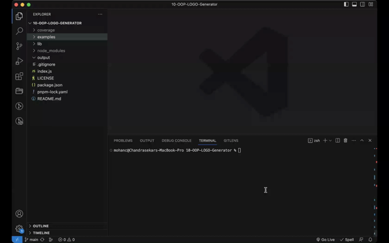

# 10-OOP-LOGO-Generator

[](http://choosealicense.com/licenses/mit/)

## Description
Application to generate the logo using SVG format. This application can create logo using basic shapes of square, circle and triangle. 

## Table of Contents
 - [Installation](#installation)
 - [Usage](#usage)
 - [Credits](#credits)
 - [License](#license)

## Installation
Clone the github repo as shown below, <br/><br/> ``` git clone git@github.com:chandraucb/10-OOP-LOGO-Generator.git ``` <br/><br/> Run node package install <br/><br/> ``` npm install ```

## Usage
To run this application execute below command and follow the prompts <br/><br/> ```node index.js ``` <br/> <br/> logo.svg file will be created under output folder <br/><br/>  

## Credits
https://github.com/SBoudrias/Inquirer.js/tree/master/packages/inquirer <br/> https://github.com/oozcitak/xmlbuilder2 
https://github.com/jwarby/inquirer-maxlength-input-prompt

## License
Copyright (c) 2023 Chandrasekar Mohan
Licensed under the MIT License


## Questions 
  Name : Chandrasekar Mohan 
  Git profile : https://github.com/chandraucb 


